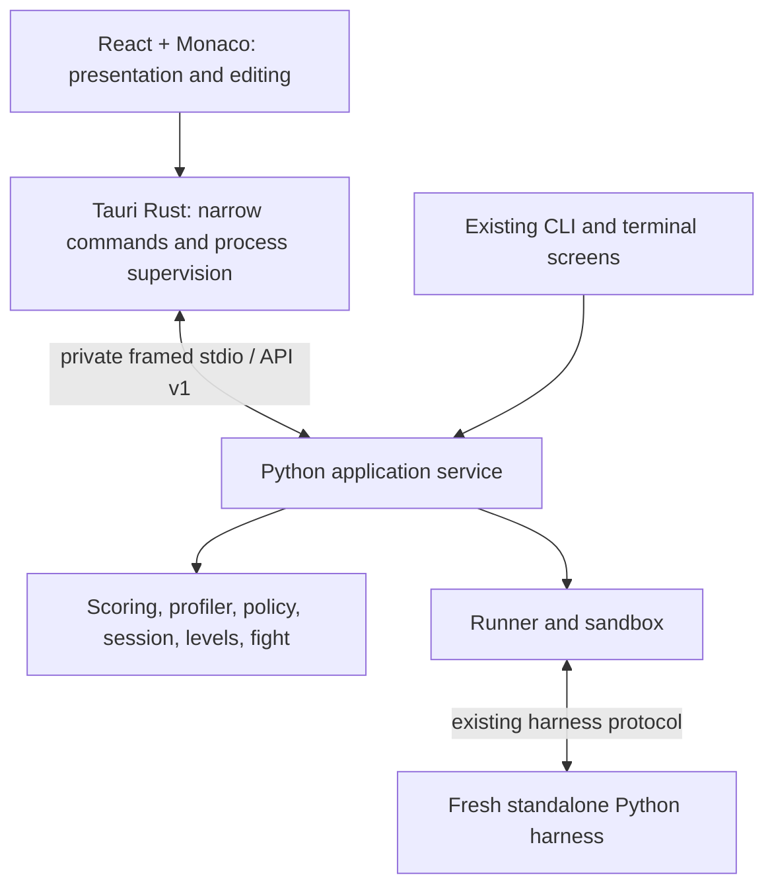

# ADR-001: VibeCoder desktop client over the Python engine

**Status: ACCEPTED.** Proposed and approved by the user on 2026-09-28.
The user authorized implementation and production work after reviewing this ADR.
Original findings below describe the Phase 0 snapshot, not current implementation.
Delivery is tracked in [T8](../trajectories/T8-desktop.md).

## Decision proposed

Use **Tauri 2 + React + TypeScript + Monaco**, with a long-lived, bundled
**CPython sidecar** exposing a stdlib-only application service over private
stdio. Keep scoring, profiling, test generation, execution, fight rules and
progress in Python. Keep desktop dependencies and tests outside `vibecoder/`
and `tests/`. Preserve the Python CLI distribution.

Tauri supports architecture-specific external executables and bidirectional
stdio. This fits the existing process boundary; its capabilities can limit
what the webview invokes. Tauri permissions protect desktop commands, **not
submitted Python**. [Sidecars](https://v2.tauri.app/develop/sidecar/),
[capabilities](https://v2.tauri.app/security/capabilities/).

Monaco is the proposed editor because editing, diagnostics, source navigation,
and breakpoint-like execution decorations are central to this product. Bundle
its workers locally; no CDN or language server is needed for v1. Validate IME,
accessibility, worker loading and memory on all three webviews before committing
to it. CodeMirror 6 remains the permitted alternative if that spike fails.

| Alternative | Assessment |
| --- | --- |
| Electron + React | Viable fallback if native webview/editor compatibility blocks Tauri; otherwise bundling a second browser is unnecessary for this workload. |
| PyQt6 | Keeps UI development in Python, but adds a separate GUI dependency/distribution and a weaker reuse path for the later web client. |
| Dear ImGui | Requires more work for the accessible text editing and document-style interface this product needs. |
| PyO3 / embedded interpreter | Adds interpreter lifecycle, ABI and build coupling without eliminating the separate submission child. Subprocess already matches the engine's design. |
| Frozen single-file Python executable | Not the initial choice: `sys.executable -I _harness.py` currently requires a real interpreter. A frozen application may relaunch itself instead. |

A small Rust shell is a goal, not a promised small download: Python, its stdlib,
Monaco and an offline Windows webview installer contribute to the actual size.
Measure artifacts before stating a size.

## Phase 0: what was established

The workspace was already a clean clone of the requested origin. Inspected
commit: `7a5940c8c95ed3dbe5c1f21d8b475241ea867644`. No duplicate clone or source
modification was needed. Python 3.11 was used per the handoff.

Read all existing files under `docs/`, including every trajectory, the work
review and the SVG's XML/text; also `CLAUDE.md`, `Hand_off.md`, `SCHEDULE.md`,
README, packaging metadata and the latest journal. Historical plans contain
stale statements; implementation and current test evidence take precedence.

| Check | Observed result |
| --- | --- |
| Full unpinned suite with host backend access | **1,420 tests, OK, 82.864 seconds**, no skips reported |
| `python3.11 -m vibecoder.cli verify --seeds 3` | **54/54 reference runs clean**: 12 levels plus six boss steps, each on three seeds |
| Restricted-environment baseline | 1,396 tests; three count failures, one unavailable-backend error, 32 skips. Host run resolved these; do not weaken the tests. |
| CLI map/showcase/profile/status | Successful; all captured transcripts had zero escape bytes |
| Practice submission and recorded replay | Passing greet reference, practice marked unbanked, recorded trace replayed successfully |
| Live boss | Reference completed; starter plus scripted reference repair completed |
| Daily | Date 2026-09-28 served `w1-l3-count`, seed 687241; two supplied-time completions recorded ranked flags `[true, false]` |
| Real PTY at 80×24 and 120×30 | Campaign → objective → failing starter → edit → passing run → campaign → quit; 110 points on attempt 2; terminal attributes restored |
| Product feel / macOS / Windows | **UNVERIFIED**; Linux automation is not human playtesting or cross-platform evidence |

A local latency sample used seed 1 at default difficulty, one cold reference
benchmark and three traced reference-source submissions per level. Generation
took 0.08–1.60 ms, cold references 56.13–93.47 ms, and per-level median
submissions 56.85–114.43 ms. These are Linux subprocess observations on Python
3.11.15, not desktop p95 or isolated-backend measurements.

All exploratory state went to temporary `VIBECODER_HOME` directories. The first
noninteractive `daily` attempt tried the host's missing `$EDITOR` (`cursor`);
subsequent checks used `--show` and supplied solutions. An initial replay probe
used an unsupported `--speed` option; replay passed with the documented command.
These were smoke-driver corrections, not application fixes.

The catalogue is **12 ordinary levels in three worlds and two three-step
bosses**. There is no universal world-lock API. The campaign marks a next level
and permits selection of the other levels; a graphical map must not introduce
new unlock requirements by implication.

## Exact engine boundaries

The complete signature and data-field inventory is [ENGINE_API.md](ENGINE_API.md).
Only the names in `vibecoder.__all__` are explicit package exports; important
module interfaces such as `Source`, `BossLevel`, `LiveRun`, `Fight` and
`all_bosses` are not re-exported there. Version is currently `0.1.0`; no stable,
versioned GUI service exists yet.

| Boundary | Existing interface | Responsibility retained |
| --- | --- | --- |
| Data | `models`: `Level`, `BossLevel`, `BossStep`, `Difficulty`, `Source`, `RunResult`, `ScoreBreakdown`, `VibeVector` | Plain stdlib data and seeded generation. `models` has no game-package dependency. |
| Catalogue | `levels.all_levels/get_level/worlds/all_bosses/get_boss`; `Level.tests_for(seed, difficulty)` | Import bundled modules only; generators run in the parent, not inside the sandbox. |
| Execution | `runner.run_code(..., source=...)`, `run_submission`, reference benchmarks | Build payload, launch child, measure and interpret results. Reference receives the same seed and difficulty. |
| Transport | `sandbox.select`, `Backend.launch → Launch(argv, pass_fds, hardening)` | Choose subprocess/bubblewrap/Docker; preserve provenance and report actual capabilities. |
| Child | `_harness.py` | Standalone interpreter script, no game imports. Untraced time/memory pass and separate traced op pass. |
| Scoring | `score_submission`, `score_fight`, `Weights`, `StepScore` | All axes, bonuses, rounding and stars. Callers currently own elapsed time, attempts and first-run cleanliness. |
| Live execution | `runner.LiveRun`: start/step/back/forward/edit/resume/abort/close | One watched test, real paused child, replay-based editing, divergence reporting. `resume()` runs freely; it is not a reversible UI pause toggle. |
| History | `timeline.Timeline`, `compare`, `Step.to_trace`; `Session.load_run` | Browse existing events without execution. Recorded event shape remains `{line, func, locals}`; live errors are separate. |
| Fight rules | `fight.Fight`, `abilities` | HP, repair costs, damage and ability costs. Fight orchestration is still in private CLI functions. |
| Personalisation | `profiler.profile_path/profile_archive/profile_sources/recommend/derive_class` | Static AST only; habits, never skill; retain archive guards and profile budgets. |
| Adaptation | `mastery`, `policy.choose_difficulty/choose_drill/limits` | Measured competence, decay, drill selection and explanations. |
| Progress | `Session.load/save/submit/record_daily/save_run` | JSON records, best scores, streak, mastery and daily history. |
| Feedback | `style.evaluate/all_met`, `tips.generate`, `Level.hints_after` | Existing educational feedback and hint pacing. |
| Terminal client | `cli`, `editor`, `repair`, `campaign`, `encounter`, `ui`, `screen`, `term` | Retain terminal presentation; do not make the desktop import `cli.py`. |

### Mechanics to preserve, and why

- Accuracy / Speed / Functional remain independent. Level weights are
  50/25/25; boss weights 40/30/30. Speed is human solve time, not execution time.
- Functional remains 70% reference-relative traced operations and 30% memory.
  A zero-accuracy submission gets zero Functional. Do not substitute wall time,
  AST estimates or a JavaScript interpreter.
- Bonuses remain +10/+5/+5 percent, allowing 120 total; stars remain 60/80/95.
  UI bars must not clip a legitimate total to 100.
- Practice excludes Speed from weighting and does not bank progress/mastery.
  Practice may still save a local run artifact, as the CLI currently does.
  Display measurement availability explicitly: the level scorer may return a
  numeric Speed even when its weight is zero; that is not a measured axis.
- Profiling retains statistics, not analysed repository source. Submitted puzzle
  source is deliberately retained in run artifacts for replay. These are two
  different privacy contracts.
- Mastery and function class stay distinct, with evidence and uncertainty shown.
  Recommendations favour gaps 60/40; daily variants deliberately do not adapt.
- Boss repairs use full step-test accuracy, not just the watched case. Editing
  restarts against identical inputs and checks the replayed prefix. It does not
  replace a running frame. Show divergence rather than pretending continuity.
- Boss score measures final source across all steps. HP is an outcome beside the
  axes. Retain repair/ability arithmetic and normal ending distinctions.
- Timing while a child awaits the player is free of the *execution* timeout;
  player deliberation can still count toward human Speed. Exclude engine pacing
  from boss Speed, exactly as `_Pacer` currently does.
- Preserve deterministic seeds, hints, local daily history, optional local
  typing rhythm, reduced motion, keyboard access and informative plain CLI output.

### Gaps a wrapper alone will not fix

1. **Client behavior diverges.** `cmd_play` adapts difficulty, passes mastery
   tags and saves traces. `Editor` generates default tests, omits tags on
   `Session.submit`, and does not request a trace. It banks successful runs;
   `cmd_play` also banks a completed unsuccessful ranked attempt. Repeated
   successful editor submissions can bank repeatedly. Extract and characterize
   these policies before choosing one desktop lifecycle; do not call them 1:1
   identical today. Proposed desktop policy follows `cmd_play`: attempts within
   a session, one completion commit; later refinement starts another session.
2. **Boss persistence is absent.** `_score_the_fight` prints its result and
   `cmd_boss` never banks it. Q84 already leaves boss progression open. Proposed
   v1 keeps bosses freely available and session results visible; durable boss
   records/unlocks require a separate approved schema/product decision.
3. **Explicit sandbox pins override provenance.** A harmless selection probe
   with `VIBECODER_SANDBOX=subprocess` and `untrusted=True` returns a nonisolating
   backend. `tests/test_provenance.py` calls this deliberate (D13). For the new
   service, require isolating provenance even under a pin and add a regression
   check; keep CLI compatibility changes explicit. No third-party level import
   is introduced in v1.
4. **Windows portability is incomplete.** Streaming uses `select` on pipes;
   Windows `select` supports sockets. `_apply_limits` returns when `resource`
   is unavailable. `cli` imports terminal modules which import Unix `termios`.
   These are source findings, not Windows execution results.
5. **Supervision needs work.** `LiveRun._readline` blocks; a non-cooperating child
   in native code needs a parent watchdog. Bound stderr/stdout draining, event
   queues and live history without changing the existing recorded trace shape.
6. **Persistence is not a transaction manager.** Profile writes use a fixed
   `.tmp` path; no interprocess lock exists. Run ids use second-resolution time,
   and artifacts are direct writes. Two completions of the same daily during
   this smoke check shared a second. Prevent collisions and lost updates before
   multiple clients use the store.
7. **Docs drift.** README describes boss scoring as unfinished; it exists.
   Some architecture text predates current backends. Keep immutable history;
   refresh living README/architecture when implementation lands.

## Proposed process and protocol architecture

`vibecoder/application/` is the proposed stdlib-only use-case layer;
`vibecoder/ipc.py` adapts it to JSON. These paths do not exist yet. Extract private
CLI boss orchestration and level lifecycle without importing terminal rendering.
Migrate CLI callers incrementally with characterization tests. The service owns
attempt count, seed, difficulty, first-run state, time and persistence; the
renderer sends intents and renders facts.

Use UTF-8 newline-delimited JSON-RPC 2.0, with namespaced `v1.*` methods and a
startup handshake exposing engine/protocol/catalogue versions and actual
execution capabilities. One protocol output writer; diagnostics on stderr.
No HTTP server, localhost port, remote HTML or generic shell command endpoint.
This is an outer application protocol, separate from the harness's existing
inner protocol, which remains unchanged.

| Proposed API family | Requests and results |
| --- | --- |
| `v1.system` | `hello`, capabilities, health, clean shutdown |
| `v1.campaign` | Catalogue metadata, world ordering, recorded stars, recommendations with reasons; no reference source or bulk hidden tests |
| `v1.level` | `prepare`, `begin`, `submit`, `complete`, `cancel`; opaque session id pins level/seed/difficulty and reference benchmark |
| `v1.boss` | `start`, `step`, `back`, `forward`, `play`, `pause`, `repair`, `abort`; authoritative source revision, cursor, HP and repairs |
| `v1.replay` | List/load saved artifacts by validated id; stream/page existing trace without re-execution |
| `v1.profile` | Analyse a user-selected path/archive, report budget/partial state, explicitly apply derived vector |
| `v1.player` | Read progress, mastery/class/ability explanations; mutations through specific use cases, never arbitrary profile replacement |
| `v1.daily` | Served date/level/seed, start, completed attempt history and local board |

Each request has an id; events carry session id, job id, sequence and revision.
Use `test.progress`, `run.finished`, `boss.step`, `boss.repair_required`,
`boss.diverged`, `player.changed`, `job.failed` notifications. Scores remain
complete Python `ScoreBreakdown` values accompanied by weights, honest axis
availability, tips, timing evidence and persisted/not-persisted status.

Validate method, types, finite numeric values, source sizes and session state.
Return structured errors such as invalid state, sandbox unavailable, syntax
error, cancelled, persistence failure and incompatible protocol. Compile repairs
before spending resources. Retries use idempotency keys; duplicate complete or
repair commands cannot award/spend twice. Reject stale revisions. Do not accept
client-computed scores, clocks, HP, hidden tests or a trust downgrade.

A worker owns each active run; a separate input dispatcher remains responsive to
cancel/close. Serialize operations per session and store. Bound message size and
queue length, drain both child pipes, backpressure live stepping rather than
losing events. An unexpected sidecar exit terminates owned submission children;
an interrupted session is never silently declared passed or banked.

`boss.play` is paced repeated `forward()`, so pause stops requesting steps.
Do not implement play by calling `LiveRun.resume()` and then claim it can pause.
Back/forward browse history until reaching its edge. Keep final score/run events
even if rendering intermediate animation frames is coalesced.

`prepare` benchmarks before timed play; `begin` starts the service's monotonic
clock when the ready editor becomes available. Preserve deliberation time;
backgrounding the app does not create free ranked time. Crash/restart recovery
must not invent elapsed time: offer an explicit practice recovery until a
reviewed persisted timing contract exists.

Rust launches fixed packaged binaries, owns picker permissions and scopes, and
uses an explicit command allowlist. Canonicalize replay ids and profile paths;
`Session.load_run` must not become an unrestricted path reader. Render code,
locals, errors and briefs as text. Enforce CSP and local assets. No telemetry
or automatic upload of source, profiles or keystroke timing.

## Cross-platform execution and packaging

Ship a private, pinned CPython 3.11 runtime with stdlib and VibeCoder; run the
service with that interpreter. Submission children use that same real interpreter
with `-I` and the standalone harness. A stdlib bootstrap can deliberately add the
packaged application directory without using user `PYTHONPATH`. Keep the wheel
and CLI usable with ordinary Python; no desktop dependency enters the wheel.

The first implementation gate is a **packaged runtime spike on Windows and
macOS**, including a live repair. A Linux source run does not satisfy it.

- Replace pipe-select streaming with a portable reader/queue mechanism while
  keeping the callback contract. Python documents the Windows limitation in
  [select](https://docs.python.org/3.11/library/select.html).
- For local player code, implement/test Windows process-tree termination and
  CPU/memory limits (Job Objects via stdlib OS bindings is the candidate).
  Check actual macOS limit enforcement; do not assume every `setrlimit` works.
  Retain parent watchdogs for computation that emits no trace events.
- Keep bubblewrap/Docker behavior on supported hosts. Third-party execution
  remains refused without a verified isolating backend. Bundled levels,
  bundled deterministic dailies and local player code need no Docker install.
  Do not market the trusted subprocess path as protection from hostile code.
- Hardened zero-setup execution of arbitrary imported community code is a future
  project. Do not solve it by silently changing `Source` to PLAYER.
- Preserve CLI commands. Guard Unix terminal imports and define/test Windows
  console support before promising the existing full-screen terminal UI there.

Release builds use native runners: macOS arm64/x86_64, Windows x86_64, Linux
x86_64 initially; add architectures only with verified runtime artifacts.
Sign/notarize the macOS application and nested executables, ship DMG; sign the
Windows application/runtime and NSIS installer; ship Linux AppImage plus package
formats as supported. Pin runtime hashes and build inputs; include license
notices and an SBOM; install without Python, Node or Rust present.

Windows first installation must work offline, including WebView2 provisioning;
Tauri documents offline/fixed-runtime options. Linux needs a declared supported
distribution baseline and clean-machine verification; AppImage alone is not a
proof of universal portability. [Windows installers](https://v2.tauri.app/distribute/windows-installer/).

Use Tauri's signed updater; update signing is distinct from OS code signing.
Publish signed artifacts and a versioned HTTPS manifest. Verify signatures,
reject downgrade/replay, defer restart during a fight, and test failed downloads
and rollback with old profile fixtures. Offline play never depends on update
availability. AppImage is the primary Linux in-app update target; package-manager
installs follow their package update channel. [Updater](https://v2.tauri.app/plugin/updater/),
[macOS signing](https://v2.tauri.app/distribute/sign/macos/).

Signed release completion requires publisher-controlled signing credentials,
notarization access, update keys and an approved release location. No credentials
are requested during this review; no signed artifacts exist yet.

## UX and product vision

**Make craftsmanship visible without turning learning into a race.** The app
should let a beginner see why correct code can still do unnecessary work, and
let an experienced player refine it without obscuring how the score is earned.

The cockpit shows three worlds, each level's real stars and a clear next action.
Separate campaign order from an explained adaptive recommendation. Offer the
local daily alongside both. All existing challenges stay accessible; avoid
invented locks, progress percentages or historical boss wins.

The workspace gives code the largest area, a resizable objective/test inspector,
and stable run/error/tip controls. Monaco supplies indentation, undo, find,
keyboard navigation and execution-line decorations. Source diagnostics come
from Python. Reveal Accuracy, Solve time (Speed), and Efficiency (Functional)
with their underlying evidence, weights and bonuses. Never animate provisional
speed/efficiency as if they were measured final scores.

The boss workspace holds HP, repairs, current function/line, locals and an
obvious pause/step/repair control. Repair focuses the failing line. A wrong
answer may have no exception line; explain that case instead of fabricating one.
History browsing is labelled; divergence stays visible. Reward both completing
the fight and the rarer flawless outcome according to the existing rules.

First run offers an optional short explanation of the three axes, a starter
level and optional local profiling. No account or repository upload. Use the
existing cyan focus/neutral chrome palette with restrained semantic colours,
visible focus, text alongside colour, adjustable font size, screen-reader labels,
native menus, platform shortcuts, and reduced-motion/static score reveal.
Optional typing rhythm remains local and does not become a scoring axis.

## Migration proposal

Use `VIBECODER_HOME` when set, otherwise `~/.vibecoder` on all desktop platforms
for v1. Avoid a second OS app-data profile and avoid moving an existing player's
files automatically. Keep `profile.json` version 1 and Vibe Vector version 4
semantics; changing the IPC version does not change player-data versions.

- Open existing profiles through `Session.load`; preserve recorded levels,
  seeds, daily attempts, mastery, streaks, tokens and unknown top-level/vector
  fields. Do not recompute historical daily choices with a new catalogue.
- Preserve existing run files byte-for-byte; read them without requiring new
  fields. Historical editor artifacts may have no trace; say so.
- Unknown **nested** fields are not universally retained today (`LevelRecord`
  and daily entry loaders filter keys). Do not claim full forward compatibility;
  add preservation or refuse incompatible writes before introducing new schemas.
- Separate UI preferences from game progress. Proposed additions such as
  durable drafts, boss records or keystroke history require explicit storage
  review; none is silently introduced by this ADR.
- Strengthen shared persistence before GUI/CLI coexistence: interprocess lock,
  reload-under-lock, unique artifact ids, atomic artifact writes, commit ids and
  crash recovery. Both updated CLI and GUI must use it. Old unmodified clients
  cannot be made lock-aware; document unsupported concurrent old-client writes.
- Create a recoverable snapshot before any future migration, test rollback, and
  never overwrite a corrupt or future-version profile with an empty one. Show
  recovery state instead of treating missing progress as a successful migration.

## Disciplined implementation gates

| Phase | Work, in order | Exit evidence |
| --- | --- | --- |
| 1: accept architecture | Review this ADR, lifecycle policy and compatibility gaps; then establish a desktop trajectory without rewriting historical exit criteria | User approval recorded; scoped backlog and supported platform matrix |
| 2a: portability proof | Bundle real Python; portable pipes, watchdog and limits; one level and edit/resume on native Windows/macOS | Clean-machine packaged tests, runaway child termination, no trace/scoring changes |
| 2b: shared Python service | Extract level/boss orchestration; stdio API; explicit provenance; transactional persistence; retain CLI adapters | CLI/service equivalence with controlled clocks, fixtures and failure paths; dependency invariant |
| 3: product client | Campaign, editor, feedback, replay, boss, daily, profiler and onboarding | End-to-end flows against real Python, accessible keyboard/mouse paths and human playtests |
| 4: distribution | Installers, signing, updater, migration fixtures, final README for GUI + CLI | Install/launch/update/uninstall offline on supported clean OS images; signature checks |
| 5: release qualification | Full regression and usability/performance evidence | Every applicable existing test green; native tests for OS-specific replacements; published support limitations |

Quality checks are added alongside each phase, not postponed until phase 5.
No existing POSIX-only test is deleted to manufacture a green Windows matrix;
run the full original gate on Linux and add native Windows/macOS coverage of
portability replacements, with explicit platform-only test markers.

Critical integration paths: first-run solve and relaunch; failed submission and
hint; practice without mastery mutation; daily replay preserving its first
ranked record; boss failing-line repair, syntax rejection without resource spend,
step-back and divergence; cancellation/crash without orphan processes; old,
corrupt and future-profile handling; duplicate commands without double banking;
malformed IPC and refused unsafe provenance. Compare scorer outputs using fixed
measurements; real memory measurements can vary by platform.

Use browser component tests for fast presentation checks and native WebdriverIO
Tauri tests against a real sidecar for integration. Current Tauri documentation
supports macOS through an embedded test driver; direct `tauri-driver` alone is
Windows/Linux. Keep embedded automation plugins out of production artifacts.
Native install/update tests remain separate. [Tauri testing](https://v2.tauri.app/develop/tests/webdriver/).

Provisional performance acceptance budgets (not measured promises): ready editor
within 250 ms p95 after selecting a prepared level; input-to-paint under 16 ms
p95 on the baseline machine; first visible execution feedback within 200 ms;
ordinary bundled reference-like submissions complete within 500 ms warm p95;
score presentation within 50 ms of engine result. Expensive or looping code gets
responsive progress/cancel, never fabricated instantaneous results. Record cold
startup, reference cache misses and isolated backend timing separately. Preserve
fresh child processes and two-pass measurement even if a target needs revision.

A later web client can reuse UI and DTOs, but browsers cannot spawn this native
Python sidecar. Local-first web execution requires a separately assessed runtime
and isolation design. Cloud sync is outside v1 and must not become a dependency
of play or a pretext to upload source.

## Review requested

Approve the Tauri/React/Monaco + stdlib Python service direction and the ordered
portability/service/client/distribution gates. The recommended desktop lifecycle
uses one completed attempt sequence per banked session and the existing
`cmd_play` adaptation/mastery behavior. Boss persistence and unlock changes stay
an explicit follow-up decision. Implementation begins only after this review,
as requested in the production directive.
